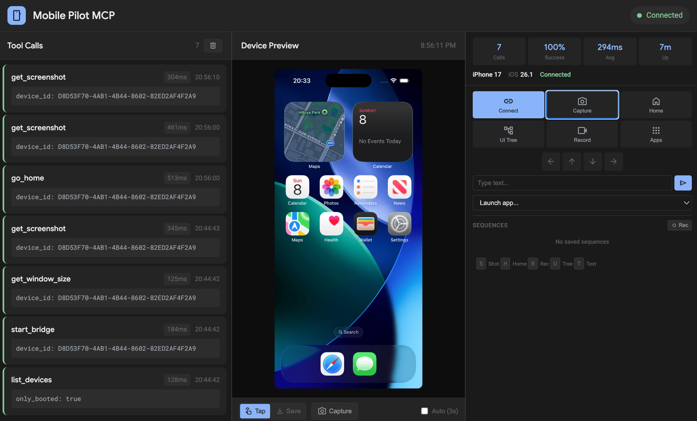

# ios-simulator-mcp



[](https://github.com/bidouilles/ios-simulator-mcp/actions/workflows/ci.yml)

MCP server for iOS Simulator automation through WebDriverAgent.
Use it from Claude, Cursor, Windsurf, and other MCP clients to tap, type, swipe, take screenshots, launch apps, and monitor sessions live.

## Prerequisites

- macOS with Xcode installed
- Xcode Command Line Tools: `xcode-select --install`
- Python 3.10+
- WebDriverAgent cloned locally from `https://github.com/appium/WebDriverAgent`

## Quick Start

1. Install and activate:

```bash
python3 -m venv venv
source venv/bin/activate
pip install -e .
```

2. Start WebDriverAgent:

```bash
# clone once (if you do not already have it)
git clone https://github.com/appium/WebDriverAgent.git ~/WebDriverAgent

# default path used by script: $HOME/WebDriverAgent
./scripts/start_wda.sh
# or
./scripts/start_wda.sh <UDID>

# optional explicit form (same as default)
WDA_PATH=~/WebDriverAgent ./scripts/start_wda.sh <UDID>

# if your clone is elsewhere, set the actual path (example: sibling directory)
WDA_PATH=../WebDriverAgent ./scripts/start_wda.sh <UDID>
```

3. Add MCP server to Claude Code:

```bash
claude mcp add ios-simulator -- /path/to/ios-simulator-mcp/venv/bin/ios-simulator-mcp
```

If WDA is not on localhost:

```bash
claude mcp add ios-simulator -e WDA_HOST=192.168.1.30 -- /path/to/ios-simulator-mcp/venv/bin/ios-simulator-mcp
```

Optional verification:

```bash
python scripts/test_install.py
```

## Dashboard

The dashboard runs automatically with the server at `http://localhost:8200`.

Main capabilities:
- Real-time tool-call monitoring
- Live screenshot preview with click-to-tap
- Quick actions (connect, capture, home, UI tree, recording, apps)

## Where Everything Else Lives

Detailed documentation is in `docs/`:

- [Setup and Configuration](docs/setup-and-config.md) for full setup, WDA host/port details, env vars, and client configuration
- [Tools Reference](docs/tools-reference.md) for complete tool catalog, predicates, bundle IDs, and examples
- [Troubleshooting](docs/troubleshooting.md) for common errors and fixes
- [Docs Index](docs/README.md) for all docs pages

## Development

```bash
pip install -e "[dev]"
ruff check .
python scripts/test_install.py
```

## License

Apache 2.0
